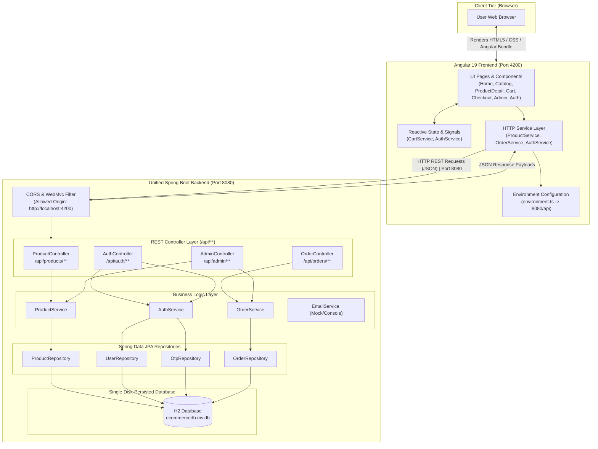

# System Architecture & Frontend-Backend Communication Guide

This document provides a comprehensive technical breakdown of how the **Lumina Luxe E-Commerce** platform is architected, how the **Angular 19 frontend** communicates with the **unified Spring Boot backend**, and the underlying architectural principles for learning and production knowledge.

---

## 1. High-Level Architectural Overview

The application follows a clean, decoupled **Two-Tier Architecture**:
1. **Presentation Tier (`e-commerce_frontend`)**: Angular 19 Single Page Application (SPA) running on `http://localhost:4200`.
2. **Service & Data Tier (`e-commerce_backend`)**: Unified Spring Boot 3.3 REST API application running on `http://localhost:8080`, backed by a single persistent H2 database (`ecommercedb.mv.db`).



---

## 2. Why a Unified Backend Architecture?

Consolidating the backend into a single, unified Spring Boot service (`e-commerce_backend`) provides several significant benefits over multi-process microservices:

| Architectural Concern | Separate Microservices | Unified Spring Boot Backend |
|---|---|---|
| **Process Count** | Multiple JVMs running simultaneously | **Single JVM process** (`mvn spring-boot:run`) |
| **Port Management** | Fragmented ports (`8081`, `8082`, etc.) | **Single predictable port** (`8080`) |
| **Database Management** | Separate DB files (`productdb`, `orderdb`) | **Single H2 database** (`ecommercedb.mv.db`) |
| **Inter-Service Calls** | HTTP `RestClient` required between services | **Direct In-Process Service Injection** (`@Autowired`) |
| **Data Consistency** | Distributed transactions (Saga / 2PC) | **Local ACID `@Transactional` boundaries** |
| **Development Complexity** | High (managing multiple scripts and builds) | **Simple and streamlined** |
| **Frontend Integration** | Frontend must route to multiple URLs | **Single unified base URL** (`/api/...`) |

---

## 3. How the Frontend Communicates with the Backend

### 3.1 Communication Protocol: REST over HTTP/JSON
Angular does not connect directly to databases. Instead, communication happens via standard **HTTP REST APIs**:
- The browser transmits HTTP verbs: `GET`, `POST`, `PATCH`, `DELETE`.
- Both requests and responses exchange lightweight, structured **JSON** payloads.

```
+---------------------------+                              +-------------------------------+
|  Angular 19 SPA           |                              |  Unified Spring Boot Backend  |
|  (http://localhost:4200)  |                              |  (http://localhost:8080)      |
+---------------------------+                              +-------------------------------+
              |                                                            |
              |  1. HTTP GET /api/products                                 |
              |----------------------------------------------------------->|
              |                                                            |  2. Query ProductRepository
              |                                                            |  3. Map ProductEntity -> DTO
              |  4. 200 OK + JSON [ {...}, {...} ]                         |
              |<-----------------------------------------------------------|
              |                                                            |
              |  5. HTTP POST /api/orders (OrderDto JSON payload)          |
              |----------------------------------------------------------->|
              |                                                            |  6. Validate, Save Order
              |  7. 201 Created + Order Confirmation JSON                  |
              |<-----------------------------------------------------------|
```

---

### 3.2 Angular HttpClient & RxJS Observables
Angular uses `@angular/common/http` to perform asynchronous network requests returning RxJS `Observable` streams.

#### Example: `ProductService`
```typescript
@Injectable({ providedIn: 'root' })
export class ProductService {
  private http = inject(HttpClient);
  private apiUrl = environment.productApiUrl; // http://localhost:8080/api/products

  loadProducts(): void {
    this.http.get<Product[]>(this.apiUrl).pipe(
      tap(products => this._products.set(products)),
      catchError(err => {
        console.warn('Backend unavailable, using fallback', err);
        return of(MOCK_PRODUCTS);
      })
    ).subscribe();
  }
}
```

**Key Patterns Used:**
- **Signals Integration**: When data arrives, Angular 19 `signal` primitives (`this._products.set(...)`) update fine-grained reactivity without re-rendering the entire component tree.
- **Graceful Fallback**: If the backend is restarting or temporarily offline, `catchError` catches the network error and provides mock fallback data, keeping the UI intact.

---

### 3.3 Centralized Environment Configuration
All backend endpoints are centralized in `e-commerce_frontend/src/environments/environment.ts`:

```typescript
const BASE_API_URL = 'http://localhost:8080/api';

export const environment = {
  production: false,
  apiUrl: BASE_API_URL,
  productApiUrl: `${BASE_API_URL}/products`,
  authApiUrl: `${BASE_API_URL}/auth`,
  orderApiUrl: `${BASE_API_URL}/orders`,
  adminApiUrl: `${BASE_API_URL}/admin`
};
```

---

### 3.4 CORS (Cross-Origin Resource Sharing)
Because the Angular frontend runs on `http://localhost:4200` and the Spring Boot backend runs on `http://localhost:8080`, browsers enforce the **Same-Origin Policy (SOP)**.

To allow secure communication, Spring Boot configures global CORS rules via `CorsConfig.java`:
```java
@Configuration
public class CorsConfig {
    @Bean
    public WebMvcConfigurer corsConfigurer() {
        return new WebMvcConfigurer() {
            @Override
            public void addCorsMappings(CorsRegistry registry) {
                registry.addMapping("/**")
                        .allowedOriginPatterns("*")
                        .allowedMethods("GET", "POST", "PUT", "PATCH", "DELETE", "OPTIONS")
                        .allowedHeaders("*")
                        .allowCredentials(true);
            }
        };
    }
}
```

> **Why `allowedOriginPatterns("*")`?**  
> When `allowCredentials(true)` is enabled (for cookies and Authorization headers), the HTTP specification forbids `Access-Control-Allow-Origin: *`. Using Spring's `allowedOriginPatterns("*")` dynamically and safely reflects the incoming origin.

---

### 3.5 Data Transfer Objects (DTOs) vs Database Entities
To maintain clear domain separation and security:
1. **JPA Entity (`ProductEntity.java`, `OrderEntity.java`)**: Models the relational table schema in H2 with internal database annotations and audit fields.
2. **DTO (`ProductDto.java`, `OrderDto.java`)**: Models the public REST API contract, parsing JSON strings into structured objects.
3. **Angular Model (`product.model.ts`, `order.model.ts`)**: TypeScript interfaces providing compile-time type safety on the client.

---

## 4. End-to-End User Flow Walkthroughs

### Flow 1: Product Browsing & Filtering
1. User navigates to `/catalog` and selects category "Audio".
2. `ProductService.ts` executes `GET http://localhost:8080/api/products?category=Audio`.
3. `ProductController.java` receives request parameters and invokes `ProductRepository.filterProducts(...)`.
4. Spring Data JPA executes query against `ecommercedb`.
5. Product entities are mapped to `ProductDto` objects and returned as a JSON array.
6. Angular's `_products` signal updates and the product cards render instantly.

### Flow 2: Passwordless OTP Authentication
1. User enters their email (`customer@lumina.com`) on the Login page.
2. `AuthService.ts` calls `POST http://localhost:8080/api/auth/send-otp` with `{"identifier": "customer@lumina.com"}`.
3. `AuthService.java` generates a secure 6-digit OTP, stores it in `ecommercedb` with a 5-minute expiration, and logs it to the terminal console.
4. User enters the OTP; `AuthService.ts` calls `POST http://localhost:8080/api/auth/verify-otp`.
5. `AuthService.java` validates the OTP, retrieves/creates the user record, and issues a session token.
6. Angular stores the session and updates `currentUser` reactive signal.

### Flow 3: Checkout & Order Placement
1. User adds items to the cart and proceeds through `/checkout`.
2. `OrderService.ts` calls `POST http://localhost:8080/api/orders`.
3. `OrderController.java` invokes `OrderService.createOrder(...)`.
4. The order is assigned a tracking number (`LUM-XXXXXXXX`) and persisted in `ecommercedb`.
5. Spring Boot responds with `201 Created` and the order details.
6. Angular routes the user to `/order-success` with tracking details and clears the shopping cart.

### Flow 4: Admin Dashboard Analytics
1. Administrator opens `/admin`.
2. Angular calls `GET http://localhost:8080/api/admin/stats`.
3. `AdminController.java` directly coordinates with `OrderRepository` and `ProductRepository` within the same Spring container:
   - Sums total sales from `OrderRepository`.
   - Counts orders by status (`PENDING`, `PROCESSING`, `DELIVERED`).
   - Retrieves active product count from `ProductRepository`.
4. Returns aggregated `AdminStats` JSON response in a single sub-millisecond call (without any remote network hops).

---

## 5. Summary Reference Table

| Aspect | `e-commerce_frontend` | `e-commerce_backend` |
|---|---|---|
| **Tech Stack** | Angular 19, TypeScript, RxJS, Signals | Spring Boot 3.3.5, Java 21, Spring Data JPA |
| **Port** | `4200` | `8080` |
| **Database** | None (Client-side Reactive Signals) | Single H2 Database (`data/ecommercedb.mv.db`) |
| **Key Responsibilities** | UI, Cart Drawer, Wishlist, Checkout, Routing | Catalog, Search, OTP Auth, Orders, Admin Analytics |
| **Start Command** | `npm start` | `mvn spring-boot:run` |
| **Startup Script** | `ng serve` | `.\start-backend.ps1` |
| **H2 Web Console** | N/A | `http://localhost:8080/h2-console` |
